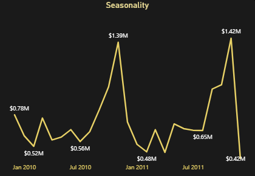
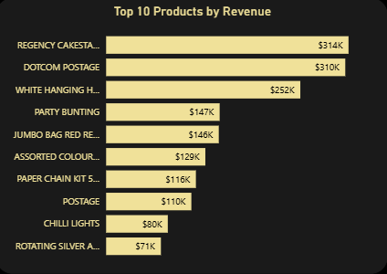
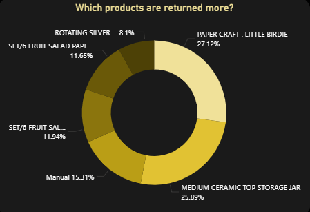
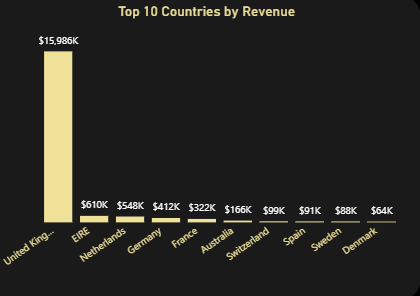

# Sales Analysis Dashboard

---

## Dataset Source & Reliability

* Source: https://archive.ics.uci.edu/dataset/502/online+retail+ii

The dataset is sourced from the **UCI Machine Learning Repository**, a widely recognized and trusted platform for academic and industry research. It contains real-world transactional data from a UK-based online retailer, making it highly suitable for:

* Sales analysis
* Customer behavior modeling
* Retail analytics use cases

Its structured format and real-world origin ensure **high reliability and practical relevance** for data analysis projects.

---

## Overview

This project presents an end-to-end **Sales Analysis Dashboard** built using Power BI, focusing on retail transaction data. The objective is to analyze sales performance, customer behavior, product trends, and return patterns to derive meaningful business insights.

---

## Tools & Techniques Used

* **Power BI**

  * Data Modeling
  * DAX (Data Analysis Expressions)
  * Dashboard Design & Visualization

* **Power Query**

  * Data Cleaning & Transformation
  * Handling missing values
  * Feature Engineering (Year, Month, Hour, Revenue)

* **Data Analysis Concepts**

  * KPI Design (Revenue, AOV, Return Rate, etc.)
  * Time Series Analysis
  * Customer Segmentation
  * Return & Loss Analysis

---

## Key KPIs

- Total Revenue  
- Total Orders  
- Average Order Value (AOV)  
- Total Customers  
- Revenue per Customer  
- Return Rate  
- Money Lost due to Returns  

---

## Sales Performance Analysis Insights

### Overall Revenue Performance

* Sales exhibit strong **seasonality**, with a significant peak in **November** across both years, likely driven by holiday demand.
* A noticeable decline in **December** is observed, which may be due to **post-peak normalization**.
* Revenue trends highlight the importance of **Q4 as the primary revenue-generating period**.

---

## Product Performance Insights

* Overall Product performance is good.

* However, Certain products show **extremely high return rates (>90%)**, suggesting:

  * Potential product quality issues
  * Incorrect listings or pricing
  * Data inconsistencies
* Filtering out invalid product descriptions (e.g., "damaged", "check") was necessary to ensure accurate product-level analysis.

---

## Customer & Order Analysis

<!--  -->

* Customer analysis includes both **registered and unknown users**, with missing customer IDs treated as "Unknown" to preserve data integrity.
* Key KPIs analyzed:

  * Total Customers
  * Total Orders
  * Average Order Value (AOV)
  * Revenue per Customer

---

## Country-Level Insights

* The **United Kingdom dominates sales (~84%)**, indicating heavy geographic concentration.
* This concentration significantly influences overall KPIs such as **AOV and total revenue**.
* Other countries contribute minimally, highlighting potential areas for **market expansion**.

---

## Key Business Takeaways

* Revenue is highly **season-dependent**, with Q4 being critical.
* The business is **geographically concentrated**, posing both risk and opportunity.
* Returns represent a **significant hidden cost**, requiring dedicated tracking.
* A small subset of products drives the majority of revenue.

---

## Actionable Insights

* Focus on **high-performing products** while investigating items with high return rates.
* Improve **quality control and product descriptions** to reduce returns.
* Explore strategies to **expand beyond the UK market** to reduce dependency.
* Leverage **seasonal trends (especially November)** for targeted marketing campaigns and inventory management.
* Monitor **return-related revenue loss** to improve profitability.

---

## Conclusion

This dashboard demonstrates how raw transactional data can be transformed into actionable business insights using Power BI. By combining data cleaning, modeling, and visualization techniques, the analysis highlights key performance drivers, risks, and opportunities.

